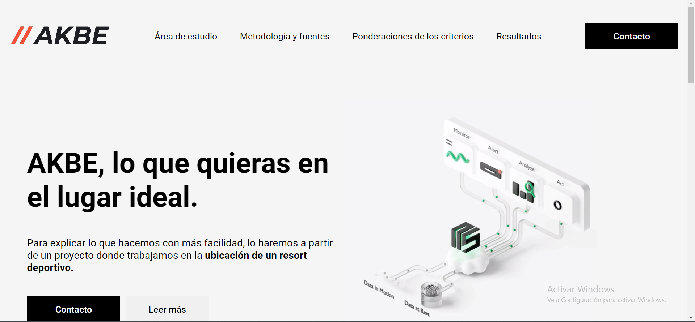

# AKBE
## 1 Tema/motivació. 

AKBE és una empresa que ofereix un servei on els clients poden consultar la ubicació òptima per realitzar qualsevol tipus d'activitat. 

**Objectiu:** Crear una web interactiva que promogui la venda d'un servei mostrant els resultats amb mapes interactius.

**Descripció:** aquesta web ofereix als usuaris una plataforma en línia on poden descobrir i explorar diferents aspectes del nostre projecte de manera interactiva i entretinguda.

**Motivació:** Compartir coneixements i experiències que es volen transmetre i ajudar altres que estiguin interessats en aquest tema.

## 2 Dades/continguts.
Tot el text de la pàgina web ha estat d'elaboració pròpia i les imatges i el clip han estat extrets de Google Images. Les dades per elaborar els resultats estan explicades en l'apartat de "Capacidades", on es mostren les diferents bases cartogràfiques utilitzades i la metodologia utilitzada per elaborar els resultats.
## 3 Estructura de la Web. 
- Pàgina de presentació: es mostra qui som, que fem i el que es vol aconseguir. Hi trobem animacions, icones i vídeos del que es vol mostrar.
    
- Área de estudio: es localitza l'àrea en la qual s'ha desenvolupat el projecte juntament amb una breu explicació del que és, imatges i amb enllaços on es mostren ampliacions de les dades.
 
- Capacidades: s'explica com s'ha desenvolupat el projecte i d'on provenen les bases cartogràfiques per elaborar els mapes mitjançant taules.
    
- Portafolios: es mostra el resultat del projecte i un breu comentari del mapa juntament amb una explicació del perquè s'ha seleccionat la ubicació indicada.
    
- Contacto: és una pàgina on els clients es poden posar en contacte amb l'empresa deixant les seves dades.
    

## 4 Web responsive. 

La técnica responsive utilitzada ha estat Media Queries:

Les Media Queries són una característica de CSS que permet aplicar estils diferents segons les característiques del dispositiu o mitjà de visualització en què es visualitza una pàgina web. Amb les Media Queries, es pot adaptar i personalitzar l'aparença del vostre lloc web en funció de factors com la mida de la pantalla, la resolució, l'orientació, la capacitat de color i altres característiques del dispositiu.

Es defineixen utilitzant la regla @media a CSS. Dins d'aquesta regla, s'especifiquen una o diverses condicions, que s'avaluen per determinar si cal aplicar els estils corresponents. Si les condicions especificades es compleixen, els estils dins de la Media Query s'aplicaran als elements seleccionats.

Finalment, ofereixen una manera poderosa de crear dissenys responsius i adaptatius. Pots utilitzar-les per ajustar la mida dels elements, amagar o mostrar contingut, canviar la disposició dels elements i molt més, en funció de les característiques del dispositiu on es visualitza el teu lloc web.

## 5 Cartografia. 
Per elaborar els mapes, s'ha fet un analisi multicriteri on s'han tingut en conte diversos factors i limitants per buscar les zones òptimes per ubicar el ressort esportiu.
La cartografia s'ha creat amb Qgis i s'ha integrat mitjançant Qgis2web a Html mitjançant els següents passos:
1. S'ha exportat les  dades de QGIS a un format compatible amb QGIS2Web: Leaflet .
2. S'han copiat els fitxers exportats (HTML, CSS, JavaScript, etc.) a la carpeta del projecte HTML.
3. S'han afegeit les referències als fitxers CSS i JavaScript necessaris al fitxer HTML.
4. S'ha creat un element 
 amb un id específic per mostrar el mapa.
  
## 6 Dificultats/millores.

  Les dificultats que hi ha hagut en alguns casos, trobar el llenguatge idoni en CSS i JS per aconseguir allò que es volia representar.

  Les millores que s'han dut a terme han sigut les següents:
  - Ampliació de la pàgina d'Área de estudio
  - Suprimir la pàgina de "Ponderaciones de los criterios" i canviar els noms de les pàgines.
  
####Pàgina abans d'aplicar les millores 
  
  ####Pàgina després d'aplicar les millores 
  

